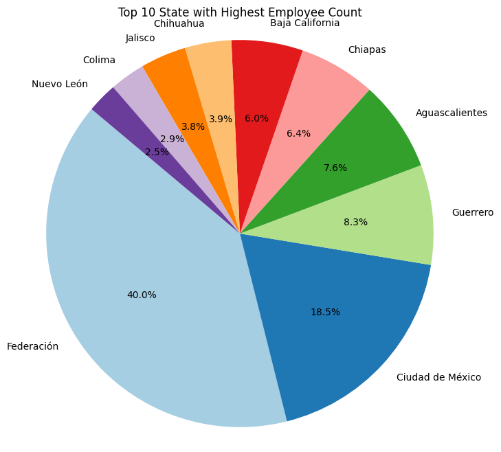
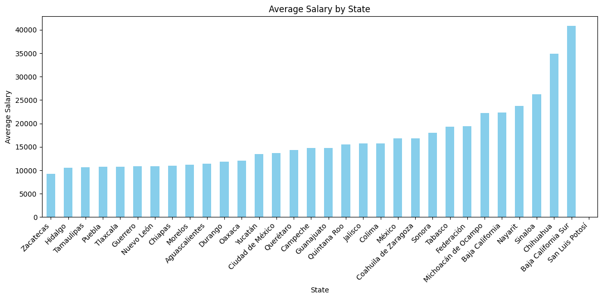

# Mexican Federal Government Salaries Analysis

## Table of Contents
- [Overview](#overview)
- [Data](#data)
- [Project Structure](#project-structure)
- [Usage](#usage)
- [Data Cleaning and Analysis](#data-cleaning-and-analysis)
- [Visualizations](#visualizations)
- [Contributing](#contributing)
- [License](#license)

## Overview

This project analyzes salary data from the Mexican Federal Government. It aims to clean and preprocess the data, perform analysis, and create visualizations to gain insights into the salary distribution across different regions and positions within the government.

Recruiters and users interested in understanding data cleaning, analysis, and visualization skills are encouraged to explore this project.

## Data

The dataset used in this project can be found in the [mexican_salaries.csv](salaries.csv) file. It includes information about employees, their positions, salaries, and reporting periods.

## Project Structure

The project is organized as follows:

- `data/`: Contains the dataset used for analysis.
- `notebooks/`: Jupyter Notebook files for data cleaning, analysis, and visualization.
- `README.md`: This README file.
- `LICENSE`: The project's license file.

## Usage

To reproduce the analysis and visualizations:

1. Clone this repository to your local machine:

